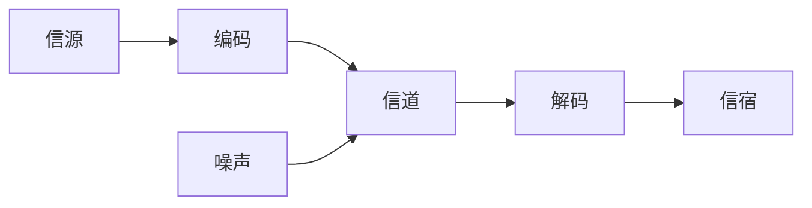

::: tip 前言

记录信息化和信息系统章节的相关知识、频繁考点。

:::

<!-- more -->

## 信息系统与信息化

香农指出信息是能够用来消除不确定的东西

- 信息：信息是系统有序程度的度量。
- 系统：系统是指由多个元素有机结合在一起, 执行特定的功能以达到特定目的的集合体。
- 信息系统：信息系统就是输入数据, 通过加工处理, 产生信息的系统。是由计算机硬件、网络和通信设备、计算机软件、信息资源、信息用户和规章制度组成的以处理信息流为目的的人机一体化系统。主要有五个基本功能, 即对信息的输入、存储、处理、输出和控制。

### 信息的质量属性

- 精确性
- 完整性
- 可靠性
- 及时性
- 经济性
- 可验证性
- 安全性
- 依附性
- 传递性
- 及时性
- 动态性

### 信息的传输模型

信息只有流动起来才能体现其价值, 信息的传输技术是信息技术的核心。

当噪声携带的信息大到一定程度的时候, 在信道中传输的信息可以被噪声掩盖导致传输失败。

### 信息化

#### 信息化从 “小” 到 “大” 的层次

- 产品信息化
- 企业信息化
- 产业信息化
- 国民经济信息化
- 社会生活信息化

信息化的主体是全体成员, 包括政府、企业、事业、团体和个人。

#### 两网一站

- 两网：政府内网和政府外网
- 一站：政府门户网站

#### 国家信息化体系六要素

- 信息资源（核心任务）
- 信息网络（基础设施）
- 信息技术应用（龙头）
- 信息技术和产业（物质基础）
- 信息化人才（成功之本）
- 信息化政策法规和标准规范（保障）

## 大型信息系统的特点

- 规模庞大 => 包含子系统甚多
- 跨地域性 => 分布广阔, 部署不集中
- 网络结构复杂 => 多级网络机构、跨域多个安全域、网络关系复杂、接口众多
- 业务种类多 => 种类多、处理逻辑复杂、业务之间关联关系复杂
- 数据量大 => 信息量大、内容多且多样
- 用户多 => 使用者多、角色多, 系统访操作多
## 信息系统生命周期

软件的生命周期包括：

- 可行性分析与项目开发计划
- 需求分析
- 概要设计
- 详细设计
- 编码
- 测试
- 运维等阶段

信息系统的生命周期：

- 【系统规划阶段】（可行性分析与项目开发计划）=> 立项阶段 ==> 输出文书：可行性研究报告、系统设计任务书
  - 对组织的环境、目标及现行系统的状况进行初步调查, 根据组织目标和发展战略, 确定信息系统的发展战略
- 【系统分析阶段】（需求分析）=> 开发阶段 ==> 输出文书：系统说明书
  - 根据系统设计任务书所确定的范围, 对现行系统进行详细调查, 描述现行系统的业务流程, 指出现行系统的局限性和不足之处, 提出新系统的逻辑模型
- 【系统设计阶段】（概要设计、详细设计）=> 开发阶段 ==> 输出文书：系统设计说明书
  - 根据系统说明书规定的功能需求, 考虑实际条件, 具体设计实现逻辑模型的技术方案, 也技术设计新系统的物理模型
- 【系统实施阶段】（编码、测试）=> 开发阶段 ==> 输出文书：实施进展报告、系统测试分析报告
  - 是将设计的系统付诸实施的阶段, 包括计算机等设备的购置、安装和调试、程序的编写和调试、人员培训、数据文件转换、系统调试与转换等
- 【系统运行和维护阶段】（运维）=> 运维及消亡阶段
  - 记录系统运行的情况, 根据一定的规则对系统进行必要的修改, 评价系统的工作质量和经济效益

## 信息系统的开发方法

### 结构化方法

自顶向下、逐步求精和模块化设计。

主要特点：

（1）开发目标清晰化
（2）开发工作阶段化
（3）开发文档规范化
（4）设计方法结构化

不足和局限性：

（1）开发周期长
（2）难以适应需求变化
（3）很少考虑数据结构

### 面向对象方法

使用结构化方法进行自顶向下的整体划分, 自底向上使用面向对象方法进行开发。

面向对象的方法构建在类和对象之上, 通过建模技术将相关对象按照业务进行分组, 形成构件。

- 【消息】体现对象间的交互，通过它向目标对象发出操作请求
- 【继承】
- 【多态】
- 【接口】

主要特点：

（1）封装性
（2）抽象性
（3）继承性
（4）动态链接性

不足和局限性：

（1）在大型项目的开发上具有一定的局限性
（2）不能涉足系统分析前的开发环节

### 原型化方法

利用系统开发工具, 快速建立一个系统模型展示给用户

主要特点：

- 使系统开发的周期缩短、成本和风险降低、速度加快
- 以用户为中心来开发系统, 用户参与度大大提高, 增加用户的满意度, 提高系统开发的成功率
- 由于用户参与了系统开发的全过程, 对系统的功能和结构容易理解和接受, 有利于系统的移交, 有利于系统的运行与维护

不足和局限性：

- 开发的环境要求高
- 管理水平要求高

### 面向服务方法

使信息系统快速响应需求与环境变化, 提高系统可复用性、信息资源共享和系统之间的互操作性, 成为影响信息化建设效率的关键问题。

主要特点：

（1）重用性
（2）注重效率
（3）松耦合
（4）职责划分

不足和局限性：

（1）代码冗余
（2）成本高

## 常规信息系统集成技术

### OSI 七层模型（开放系统互连参考模型）

- 物理层 => 协议：RJ-45、V.35、RS232、FDDI
  - 包括物理联网媒介
- 数据链路层 => 协议：IEEE 802.3/.2、HDLC、PPP、ATM
  - 控制网络层与物理层之间的联系
- 网络层 => 协议：IP、ICMP、IGMP、ARP、IPX
  - 将网络地址翻译成队员的物理地址
- 传输层 => 协议：TCP、UDP、SPX
  - 负责确保数据可靠、顺序、无错的从 A 点传输到 B 点
- 会话层 => 协议：SQL、NFS、RPC
  - 负责在网络中两节点之间建立和维持通信, 以及提供交互会话的管理功能
- 表示层 => 协议：JPEG、ASCLL、GIF、DES、MPEG
  - 如同应用程序和网络之间的翻译官
- 应用层 => 协议：HTTP、Telnet、FTP、SMTP
  - 负责对软件提供接口以便程序能够使用网络服务

### TCP/IP 四层模型

- 应用层（应用层、表示层、会话层）
- 传输层（传输层）
- 网络层（网络层）
- 网络接口层（物理层、数据链路层）

### 协议

- TCP => 可靠的、面向连接的
- UDP => 不可靠的、无连接的
- FTP、HTTP、Telnet、SMTP => 建立在 TCP 基础之上
- TFTP、DNS、DHCP、SNMP => 建立在 UDP 基础之上

### 网络设备

| 互联设备   | 工作层次             |
| ---------- | -------------------- |
| 中继器     | 物理层               |
| 网桥       | 数据链路层           |
| 路由器     | 网络层               |
| 网关       | 高层（第 4 ～ 7 层） |
| 集线器     | 物理层               |
| 二层交换机 | 数据链路层           |
| 三层交换机 | 网络层               |
| 多层交换机 | 高层（第 4 ～ 7 层） |

### 网络存储技术

- DAS（直接附加存储）=> 直接与主机系统相连, 很难扩展、传递距离、连接数量、传输速率等方面都受到限制
- NAS（网络附加存储）=> 直接与网络介质相连, 需要通过数据网关来访问 NAS, 响应速度快、数据传输速率高, 即插即用
- SAN（存储区域网络）=> 管理方便、扩展容易、具有无限的可扩展能力

### 网络接入技术

### 有线接入方式

（1）PSTN
（2）ISDN
（3）ADSL
（4）FTTx+LAN
（5）HFC

#### 无线接入方式

（1）GPRS
（2）Wifi
（3）3G、4G、5G

### 网络规划与设计

#### 网络设计工作

- 网络拓扑结构设计
- 主干网络（核心层）设计
- 汇聚层和接入层设计
- 广域网连接与远程访问设计
- 无线网络设计
- 网络安全设计
- 设备选型

#### 信息安全的基本要素

- 机密性：确保信息不暴露给未授权的实体或进程
- 完整性：只有得到允许的人才能修改数据, 并且能够判别出数据是否已被篡改
- 可用性：得到授权的实体在需要时可访问数据, 即攻击者不能占用所有的资源而阻碍授权者的工作
- 可控性：可以控制授权范围内的信息流向以及行为方式
- 可审查性：对出现的网络安全问题提供调查的依据和手段

### 数据库管理系统

- Oracle => 关系型数据库
- MySQL => 关系型数据库
- SQLServer => 关系型数据库
- mongoDB => 非关系型数据库

### 数据仓库

数据仓库是一个面向主题的、集成的、非易失的、且随时间变化的数据集合, 用于支持管理决策。

体系结构的 4 个层次

（1）数据源
（2）数据的存储与管理
（3）OLAP 服务器（联机分析处理）
（4）前端工具

### 中间件技术

中间件的分类：

- 底层型中间件 => JVM（Java 虚拟机）、CLR（公共语言运行库）、ACE（自适应通信环境）、JDBC（数据库连接）、ODBC（开放数据库互连）
- 通用型中间件 => CORBA（公共对象请求代理体系结构）、J2EE、MOM（面向消息的中间件）、COM
- 集成型中间件 => WorkFlow、EAI（企业应用集成）

为了完成不同层次的集成, 可以采用的技术、产品：

- 为了完成系统底层传输层的集成, 可以采用 CORBA（公共对象请求代理体系结构）技术
- 为了完成不同系统的信息传递, 可以采用消息中间件产品
- 为了完成不同硬件和操作系统的集成, 可以采用 J2EE 中间件产品

### 高可用性和高可靠性的规划与设计

常见的可用性战术：

- 错误检测：用于错误检测的战术包括命令/响应、心跳和异常
- 错误恢复：用于错误恢复的战术包括表决、主动冗余、被动冗余
- 错误预防：用于错误预防的战术包括出错的组件从服务中删除、引入进程监视器

## CMMI 模型

### 阶段式模型（过程域的阶段式分组）

| 成熟度等级 | 过程域                                                                                                                                                              |
| ---------- | ------------------------------------------------------------------------------------------------------------------------------------------------------------------- |
| 可管理级   | 需求管理、项目计划、配置管理、项目监督与控制、供应商和他管理、质量和分析、过程和产品质量保证                                                                        |
| 已定义级   | 需求开发、技术解决方案、产品集成、验证、确认、组织 级过程焦点、组织级过程定义、组织级培训、集成项目管理、风险管理、集成化的团队、决策分析和解决方案、组织级集成环境 |
| 量化管理级 | 组织级过程性能、定量项目管理                                                                                                                                        |
| 优化管理级 | 组织级改革与实施、因果分析和解决方案                                                                                                                                |

### 连续型模型（连续式模型的过程域分组）

| 连续式分组 | 过程域                                                                                             |
| ---------- | -------------------------------------------------------------------------------------------------- |
| 过程管理   | 组织级过程焦点、组织级过程定义、组织级培训、组织级过程性能、组织级改革与实施                       |
| 项目管理   | 项目计划、项目监督与控制、供应商和他管理、集成项目管理、风险管理、集成化的团队、定量项目管理       |
| 工程       | 需求管理、需求开发、技术解决方案、产品集成、验证、确认                                             |
| 支持       | 配置管理、质量和分析、过程和产品质量保证、决策分析和解决方案、组织级集成环境、因果丰兰息和解决方案 |

## 软件工程

### 系统规划

- 要从用户的现状出发
- 从技术的变革为导向
- 从用户的需求为基础
- 依据企业的战略目标

### 软件需求

- 业务需求：反映企业或客户对系统高层次的目标要求
- 用户需求：描述的是用户的具体目标, 或用户要求系统必须能完成的任务
- 系统需求：从系统的角度来说明软件的需求, 包括功能需求、非功能需求和设计约束等

### 需求获取

需求获取是一个确定和理解不同的项目干系人的需求和约束过程。常见的需求获取方法包括用户访谈、问卷调查、采样、情节串联板、联合需求计划等

### 需求分析

质量功能部署（QFD）将软件需求分为三类：

- 常规需求：用户认为系统应该做到的功能或性能
- 期望需求：用户想当然认为系统应具备的功能或性能, 但并不能正确描述自己想要得到的这些功能或性能需求
- 意外需求：用户要求范围外的功能或性能

一个好的需求应该具有无二义性、完整性、一致性、可测试性、确定性、可跟踪性、正确性、必要性等特性

需求开发活动的产物：软件需求规格说明书（SRS）=> 使用国家标准 GB/T 8567-2006, 其中说明书内容包括：

1. 范围
2. 引用文件
3. 需求分析
4. 合格性规定
5. 需求可追踪性
6. 尚未解决的 问题
7. 注解
8. 附录

需求验证也称为需求确认, 在实际工作中, 一般通过需求评审和需求测试工作来需求进行验证。需求评审就是对 SRS 进行技术评审。

### UML 统一建模语言

使用实体联系图（E-R 图）表示数据模型, 用数据流图（DFD）表示功能模型, 用状态转换图（STD）表示行为模型

- 五种系统视图

（1）用例视图
（2）逻辑视图
（3）实现视图
（4）过程视图
（5）部署视图

- 静态图和动态图

静态图：用例图、类图、对象图、组件图、配置图
动态图：序列图、状态图、协作图、活动图

- 用例图：描述系统的功能, 由系统、用例和角色三种元素组成
- 类图：表示系统中的类以及类与类之间的联系, 描述系统的静态结构, 用于逻辑视图中
- 对象图：描述一组对象已经它们之间的联系
- 状态图：描述对象、子系统、系统的生命周期, 描述一个特定对象的所有可能状态以及由于各种事情的发生而引起的状态之间的转移, 由状态、转移、事件和活动组成
- 序列图：也称顺序图, 是一种叫交互图, 由一组对象或参与者以及它们自家可能发生的消息构成
- 协作图：描述协作对象之间的交互和连接
- 活动图：显示动作以及结果, 描述操作实现中所完成的工作以及用例实例或对象中的活动
- 组件图：用来反映代码的物理结构

UML 用例关系

- 关联关系 => 执行者与用例之间的管理学, 又称通信关系
- 泛化关系 => 执行者之间只有一种关系
- 包含关系 => 多个用例具有一部分相同的行为, 将这部分相同的行为抽取出来与原来的用例形成一个包含关系
- 扩展关系 => 一个用例在执行时可能会使用到一个新的用例

### 面向对象分析（OOA）、面向对象设计（OOD）

OOA（面向对象分析）的任务是“做什么”, OOA（面向对象设计）的任务是“怎么做”

面向对象分析阶段的核心工作是建立系统的用例模型与分析模型

### 用例的关系

- 包含关系 => 可以从两个或者两个以上的用例提取公共行为
- 扩展关系 => 根据情况可能发生多种分支
- 泛化关系 => 可以将它们的共性抽象成为父用例

### 类的关系

- 关联关系 => 关联不同类的对象之间的结构关系, 关联体现的对象实例之间的关系, 而不是表示两个类之间的关系
- 依赖关系 => 其中一个类的变化会引起另一个类的变化
- 泛化关系 => 泛化关系描述一般事物与该事物中的特殊种类之间的关系, 也就是父类与子类之间的关系
- 共享聚集 (聚合关系) => 表示类之间的整体与部分的关系
- 组合聚集 (组合关系) => 表示类之间的整体与部分的关系
- 实现关系 => 实现关系将说明和实现联系起来

## 软件架构

软件架构不仅指定了系统的组织结构和拓扑结构, 并且显示系统需求和构件之间的对应关系, 提供一些设计决策的基本原理

软件架构设计的核心问题：是能否达到架构级的软件复用

解决好软件的复用、质量和维护问题, 是研究软件架构的根本目的

### 软件架构风格

- 数据流风格：包括批处理序列和管道/过滤器两种风格
- 调用/返回风格：包括主程序/子程序、数据抽象和面向对象, 以及层次结构
- 独立构件风格：包括进程通信和事件驱动的系统
- 虚拟机风格：包括解释器和基于规则的系统
- 仓库风格：数据库系统、黑板系统和超文本系统

## 软件设计

### 结构化设计（SD）

是一个自顶向下、逐步求精和模块化的过程, 分为概要设计和详细设计的两个阶段。

遵循的基本原则：高内聚、低耦合, 模块间低耦合, 模块内高内聚

### 面向对象设计（OOD）

包含了抽象、封装和可扩展性, 其中可扩展性主要通过继承和朵态实现

## 软件测试

### 静态测试

指被测试程序不在机器上运行, 而采用人工检测和计算机辅助静态分析的手段对程序进行检测。一般采用桌前检查、代码走查和代码审查

### 动态测试

#### 白盒测试

也称为结构测试, 主要用于软件的单元测试, 它的主要思想是, 将程序看作一个透明的白盒, 测试人员完全清楚程序的结构和处理算法。

#### 黑盒测试

也称为功能测试, 主要用于集成测试、确认测试和系统测试, 它的主要思想是,将程序看作一个不透明的黑盒, 测试人员完全不考虑（或者不了解）程序的内部结构和处理算法

## 软件测试分类

（1）单元测试 => 测试依据软件详细设计说明书
（2）集成测试 => 测试依据软件概要设计说明书
（3）确认测试 => 主要用于检测软件的功能、性能、和其他特性是否与用户需求一致
（1）内部确认测试
（2）Alpha 测试和 Beta 测试
（3）验收测试
（4）系统测试
（5）配置项测试
（6）回归测试

## 软件集成技术

1. 表示集成：也称为界面集成, 是黑盒集成, 无须了解程序与数据库的内部构造
2. 数据集成：是白盒集成
3. 控制集成
4. 业务流程集成：也称为过程集成
5. 企业之间的应用集成

控制集成与表示集成、数据集成相比, 灵活性更高
表示集成和数据集成适用的环境下, 都适用于控制集成

## 物联网

### 关键技术

- 传感器技术

  RFID（射频识别）=> 可通过无线电信号识别特点目标并读写相关数据, 而无需识别系统与特定目标之间建立机械或光学接触, 具有远距离读取、高存储容量、成本高、可同时被读取、难复制、可工作于各种恶劣环境等特点

- 嵌入式技术

  综合计算机软硬件、传感器技术、集成电路技术、电子应用技术为一体的复杂技术

### 物联网架构

- 应用层 => 物联网发展的根本目标
- 网络层 => 包括互联网、广电网、网络管理系统和云计算平台等组成, 是整个物联网的中枢
- 感知层 => 由各种传感器构成, 是物联网识别物体、采集信息的来源

## 云计算服务

- IaaS（基础设施即服务）=> 向用户提供计算机能力、存储空间等基础设施方面的服务
- PaaS（平台即服务）=> 向用户提供虚拟的操作系统、数据库管理系统、Web 应用等平台服务
- SaaS（软件即服务）=> 向用户提供软件（如 CRM、办公软件等）、组件、工作流等虚拟化软件服务, 使软件提供商从软件产品的生产者转变层服务的运营者

## 大数据的特征

（1）大量
（2）多样
（3）价值
（4）高速
（5）真实性

大数据从数据源经过分析挖掘到最终获得价值, 包括 5 个环节：数据准备、数据存储与管理、计算处理、数据分析和知识展现。

## 移动互联网特点

- 终端移动性
- 业务使用的私密性
- 终端和网络的局限性
- 业务与终端、网络的强关联性

## 信息安全

### 信息系统安全

- 设备安全
  - 设备的稳定性 => 设备在一定时间内不出故障的概率
  - 设备的可靠性 => 设备能在一定时间内正常执行任务的概率
  - 设备的可用性 => 设备随时可以正常使用的概率
- 数据安全 => 静态安全
  - 秘密性
  - 可用性
  - 完整性
- 内容安全 => 包括信息内容保密、信息隐私保护等
- 行为安全 => 动态安全

### 信息安全保护等级

- 第一级：会对公民、法人和其他组织的合法权益造成损害, 但不损害国家安全、社会秩序和公共利益
- 第二级：会对公民、法人和其他组织的合法权益产生严重损害, 或者对社会秩序和公共利益造成损害, 但不损害国家安全
- 第三级：会对社会秩序和公共利益造成严重损害, 或者对国家安全造成损害
- 第四级：会对社会秩序和公共利益造成特别严重损害, 或者对国家安全造成严重损害
- 第五级：会对国家安全造成特别严重损害

### 计算机系统安全保护能力等级

- 第一级：用户自主保护级
- 第二级：系统审计保护级
- 第三级：安全标记保护级
- 第四级：结构化保护级
- 第五级：访问验证保护级

### 信息加密

#### 对称加密技术

加密和解密使用相同的密钥

典型算法：数据加密标准（DES）、国际数据加密算法（IDEA）、数据加密标准算法（AES）

#### 非对称加密

加密用“公钥”, 解密用“私钥”

典型算法：RSA、ECC

#### Hash 函数

Hash 函数可提供保密性、豹纹认证以及数字签名功能

#### 数字签名

是证明当事者身份和数据真实性的一种信息。它采用非对称加密钥加密技术与数字摘要技术的应用。

### 信息系统安全

- 计算机设备安全
  - 物理安全
  - 设备安全
  - 存储介质安全
  - 可靠性技术
- 网络安全
  - 防火墙
    - 阻挡对网络的非法访问和不安全数据的传递，使本地系统和网络免于收到许多网络安全威胁
  - 入侵检测系统（IDS）
    - 注重对网络安全状况的监管，通过监视网络或系统资源，寻找违反安全策略的行为或攻击迹象，并发出报警
  - 入侵防护系统（IPS）
    - 倾向提供主动防护，注重对入侵行为的控制
  - 虚拟专用网络（VPN）
  - 安全扫描
  - 网络蜜罐技术
    - 是一种制定防御技术，是入侵检测技术的一个重要发展方向
- 操作系统安全
  - 切断（可用性的威胁）
  - 截取（机密性的威胁）
  - 篡改（完整性的攻击）
  - 伪造（合法性的威胁）
- 数据库安全
- 应用系统安全
  - Web 访问控技术
  - 单点登录（SSD）技术
  - 网页防篡改技术
  - Web 内容安全

## 电子政务

- 政府对政务（G2G）
- 政府对企业（G2B）
- 政府对公众（G2C）
- 政府对公务员（G2E）

## 电子商务

- 企业与企业之间的电子商务（B2B）=> 阿里巴巴（1688）
- 企业与消费者之间的电子上礼物（B2C）=> 京东、当当、苏宁
- 消费者与消费者之间的电子商务（C2C）=> 淘宝、易趣、闲鱼
- 线上购买线下的商品和服务（O2O）=> 淘票票、美团、饿了么

## 企业系统规划（BSP）

（1）准备工作
（2）定义企业过程
（3）识别定义数据类
（4）分析现有系统
（5）确定管理部门对系统的要求
（6）制定建议书和开发计划
（7）成功报告

## 信息系统的规划工具

信息系统规划（ISP）是从企业战略出发, 构建企业基本的信息系统架构, 利用信息系统管理企业行为, 辅助企业进行决策。

- 制定计划时 => PERT 图和甘特图
- 访谈 => 调查表和调查提纲
- 确定需求 => 会谈和正式会议
- 企业组织结构与企业过程联系 => 过程/组织（P/O）矩阵
- 采用实体法归纳出数据类 => 资源/数据（R/D）矩阵
- 分析过程的输入数据类和输出数据类, 归纳出系统的数据类 => 输入-处理-输出（IPO）矩阵
- 以企业过程为行, 以数据为列 => CU 矩阵

## 智慧城市建设参考模型

（1）物联感知层
（2）通信感知层
（3）计算与存储层
（4）数据及服务支撑层
（5）智慧应用层

## “互联网+”

“互联网+”简单的说就是“互联网+传统行业”

“互联网+”的六大特征：

（1）跨界融合
（2）创新驱动
（3）重塑结构
（4）尊重人性
（5）开发生态
（6）连接一切

## 区块链

区块链是分布式数据存储、点对点传输、共识机制、加密算法等计算机技术的新型应用模式。

区块链的特征：

（1）去中心化
（2）开放性
（3）自治性
（4）信息不可篡改性
（5）匿名性

## 元宇宙

元宇宙是一种沉浸式体验, 可以完成很高级的感知和交互, 但其本质仍然是构建在程序之上的虚拟世界

核心技术：

（1）物联网技术
（2）区块链技术
（3）交互技术
（4）电子游戏技术
（5）人工智能技术
（6）网络及运算技术
