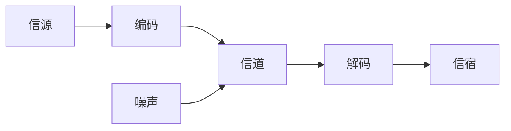

::: tip 前言

记录信息化和信息系统章节的相关知识、频繁考点。

:::

<!-- more -->

# 信息系统与信息化

::: tip 信息的基本概念

香农指出信息是能够用来消除不确定的东西

:::

- 信息：信息是系统有序程度的度量。
- 系统：系统是指由多个元素有机结合在一起, 执行特定的功能以达到特定目的的集合体。
- 信息系统：信息系统就是输入数据, 通过加工处理, 产生信息的系统。是由计算机硬件、网络和通信设备、计算机软件、信息资源、信息用户和规章制度组成的以处理信息流为目的的人机一体化系统。主要有五个基本功能，即对信息的输入、存储、处理、输出和控制。

## 信息的质量属性

- 精确性
- 完整性
- 可靠性
- 及时性
- 经济性
- 可验证性
- 安全性

## 信息的传输模型

信息只有流动起来才能体现其价值, 信息的传输技术是信息技术的核心。

当噪声携带的信息大到一定程度的时候, 在信道中传输的信息可以被噪声掩盖导致传输失败。

## 信息化

### 信息化从 “小” 到 “大” 的层次

- 产品信息化
- 企业信息化
- 产业信息化
- 国民经济信息化
- 社会生活信息化

信息化的主体是全体成员, 包括政府、企业、事业、团体和个人。

### 两网一站

- 两网：政府内网和政府外网
- 一站：政府门户网站

### 国家信息化体系六要素

- 信息资源（核心任务）
- 信息网络（基础设施）
- 信息技术应用（龙头）
- 信息技术和产业（物质基础）
- 信息化人才（成功之本）
- 信息化政策法规和标准规范（保障）

## 信息系统生命周期

软件的生命周期包括：

- 可行性分析与项目开发计划
- 需求分析
- 概要设计
- 详细设计
- 编码
- 测试
- 运维等阶段

信息系统的生命周期：

- 【系统规划阶段】（可行性分析与项目开发计划）=> 立项阶段 ==> 输出文书：可行性研究报告、系统设计任务书
- 【系统分析阶段】（需求分析）=> 开发阶段 ==> 输出文书：系统说明书
- 【系统设计阶段】（概要设计、详细设计）=> 开发阶段 ==> 输出文书：系统设计说明书
- 【系统实施阶段】（编码、测试）=> 开发阶段 ==> 输出文书：实施进展报告、系统测试分析报告
- 【系统运行和维护阶段】（运维）=> 运维及消亡阶段

# 信息系统的开发方法

## 结构化方法

自顶向下、逐步求精和模块化设计。

主要特点：

- 开发目标清晰化
- 开发工作阶段化
- 开发文档规范化
- 设计方法结构化

不足和局限性：

- 开发周期长
- 难以适应需求变化
- 很少考虑数据结构

## 面向对象方法

使用结构化方法进行自顶向下的整体划分, 自底向上使用面向对象方法进行开发。

主要特点：

- 封装性
- 抽象性
- 继承性
- 动态链接性

不足和局限性：

- 在大型项目的开发上具有一定的局限性
- 不能涉足系统分析前的开发环节

## 原型化方法

利用系统开发工具, 快速建立一个系统模型展示给用户

主要特点：

- 使系统开发的周期缩短、成本和风险降低、速度加快
- 以用户为中心来开发系统, 用户参与度大大提高, 增加用户的满意度, 提高系统开发的成功率
- 由于用户参与了系统开发的全过程, 对系统的功能和结构容易理解和接受, 有利于系统的移交, 有利于系统的运行与维护

不足和局限性：

- 开发的环境要求高
- 管理水平要求高

## 面向服务方法

使信息系统快速响应需求与环境变化, 提高系统可复用性、信息资源共享和系统之间的互操作性, 成为影响信息化建设效率的关键问题。

主要特点：

- 重用性
- 注重效率
- 松耦合
- 职责划分

不足和局限性：

- 代码冗余
- 成本高

# 常规信息系统集成技术

## OSI 七层模型（开放系统互连参考模型）

- 物理层 => 协议：RJ-45、V.35、RS232、FDDI
  - 包括物理联网媒介
- 数据链路层 => 协议：IEEE 802.3/.2、HDLC、PPP、ATM
  - 控制网络层与物理层之间的联系
- 网络层 => 协议：IP、ICMP、IGMP、ARP、IPX
  - 将网络地址翻译成队员的物理地址
- 传输层 => 协议：TCP、UDP、SPX
  - 负责确保数据可靠、顺序、无错的从 A 点传输到 B 点
- 会话层 => 协议：SQL、NFS、RPC
  - 负责在网络中两节点之间建立和维持通信, 以及提供交互会话的管理功能
- 表示层 => 协议：JPEG、ASCLL、GIF、DES、MPEG
  - 如同应用程序和网络之间的翻译官
- 应用层 => 协议：HTTP、Telnet、FTP、SMTP
  - 负责对软件提供接口以便程序能够使用网络服务

## TCP/IP 四层模型

- 应用层（应用层、表示层、会话层）
- 传输层（传输层）
- 网络层（网络层）
- 网络接口层（物理层、数据链路层）

## 协议

- TCP => 可靠的、面向连接的
- UDP => 不可靠的、无连接的
- FTP、HTTP、Telnet、SMTP => 建立在 TCP 基础之上
- TFTP、DNS、DHCP、SNMP => 建立在 UDP 基础之上

## 网络设备

| 互联设备   | 工作层次             |
| ---------- | -------------------- |
| 中继器     | 物理层               |
| 网桥       | 数据链路层           |
| 路由器     | 网络层               |
| 网关       | 高层（第 4 ～ 7 层） |
| 集线器     | 物理层               |
| 二层交换机 | 数据链路层           |
| 三层交换机 | 网络层               |
| 多层交换机 | 高层（第 4 ～ 7 层） |

## 网络存储技术

- DAS（直接附加存储）=> 直接与主机系统相连, 很难扩展、传递距离、连接数量、传输速率等方面都受到限制
- NAS（网络附加存储）=> 直接与网络介质相连, 需要通过数据网关来访问 NAS, 响应速度快、数据传输速率高, 即插即用
- SAN（存储区域网络）=> 管理方便、扩展容易、具有无限的可扩展能力

## 网络接入技术

### 有线接入方式

- PSTN
- ISDN
- ADSL
- FTTx+LAN
- HFC

### 无线接入方式

- GPRS
- Wifi
- 3G、4G、5G

## 网络规划与设计

### 网络设计工作

- 网络拓扑结构设计
- 主干网络（核心层）设计
- 汇聚层和接入层设计
- 广域网连接与远程访问设计
- 无线网络设计
- 网络安全设计
- 设备选型

### 信息安全的基本要素

- 机密性：确保信息不暴露给未授权的实体或进程
- 完整性：只有得到允许的人才能修改数据, 并且能够判别出数据是否已被篡改
- 可用性：得到授权的实体在需要时可访问数据, 即攻击者不能占用所有的资源而阻碍授权者的工作
- 可控性：可以控制授权范围内的信息流向以及行为方式
- 可审查性：对出现的网络安全问题提供调查的依据和手段

## 数据库管理系统

- Oracle => 关系型数据库
- MySQL => 关系型数据库
- SQLServer => 关系型数据库
- mongoDB => 非关系型数据库

## 数据仓库

数据仓库是一个面向主题的、集成的、非易失的、且随时间变化的数据集合, 用于支持管理决策。

体系结构的 4 个层次

- 数据源
- 数据的存储与管理
- OLAP 服务器（联机分析处理）
- 前端工具

## 中间件技术

中间件的分类：

- 底层型中间件 => JVM（Java 虚拟机）、CLR（公共语言运行库）、ACE（自适应通信环境）、JDBC（数据库连接）、ODBC（开放数据库互连）
- 通用型中间件 => CORBA（公共对象请求代理体系结构）、J2EE、MOM（面向消息的中间件）、COM
- 集成型中间件 => WorkFlow、EAI（企业应用集成）

为了完成不同层次的集成, 可以采用的技术、产品：

- 为了完成系统底层传输层的集成, 可以采用 CORBA（公共对象请求代理体系结构）技术
- 为了完成不同系统的信息传递, 可以采用消息中间件产品
- 为了完成不同硬件和操作系统的集成, 可以采用 J2EE 中间件产品

## 高可用性和高可靠性的规划与设计

常见的可用性战术：

- 错误检测：用于错误检测的战术包括命令/响应、心跳和异常
- 错误恢复：用于错误恢复的战术包括表决、主动冗余、被动冗余
- 错误预防：用于错误预防的战术包括出错的组件从服务中删除、引入进程监视器

# 软件工程

## 软件需求

- 业务需求：反映企业或客户对系统高层次的目标要求
- 用户需求：描述的是用户的具体目标，或用户要求系统必须能完成的任务
- 系统需求：从系统的角度来说明软件的需求，包括功能需求、非功能需求和设计约束等
